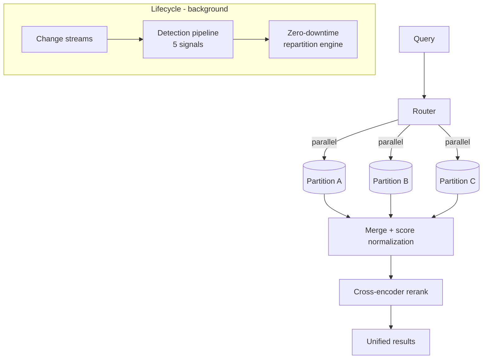
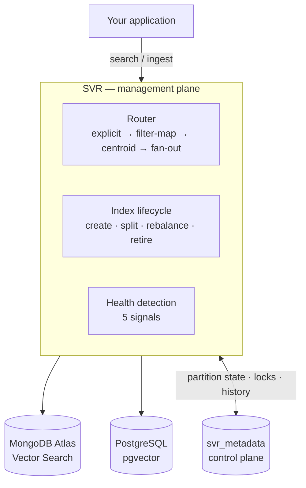

# Semantic Vector Router (SVR) — Experimental

> **A Python SDK that keeps vector search accurate at scale by automatically partitioning, routing, merging, and reranking — across MongoDB Atlas Vector Search and PostgreSQL/pgvector.**
> **Status: Experimental research prototype** — APIs and design may change; not a supported product release.
> Sanitized public version of a real-world prototype — client names, credentials, and internal endpoints removed; all configuration is environment-driven (`.env.example`). Authored by [Paul Cleenewerck](https://github.com/pcleene).

## The problem

Vector search quality degrades under two conditions that often co-occur:

1. **Scale** — past tens of millions of vectors, ANN approximation error and quantization noise compound, so recall drops and p95 latency climbs.
2. **Heterogeneity** — mixing unrelated content (products + tickets + contracts) pollutes the embedding space, so irrelevant neighbors surface with deceptively high scores.

Naïve fixes don't hold up: **pre-filtering** traverses a broken ANN graph (missing edges), and **post-filtering** can return mostly-empty result sets when the filter is selective. The real fix is to split the space into coherent sub-indexes — but doing that by hand turns search into an infrastructure project: indexes per category, routing logic, rebalancing, migrations, all kept in sync as data grows.

## The approach

SVR partitions a large/heterogeneous vector space into coherent sub-indexes, then makes that transparent to application code: you say *what* to search, SVR handles parallel execution, score-normalized merging, and optional cross-encoder reranking.



Structurally, SVR is a thin management plane between your application and the vector backend. MongoDB always holds the metadata/control plane — partition state, distributed locks, operation history — regardless of where the vectors themselves live.



## Intelligent routing

The part most worth understanding. When you search across many partitions, the naïve approach is fan-out: N partitions means N vector searches. SVR instead resolves each query through a **four-step cascade** with first-match-wins semantics, which turns routing from O(N) into roughly O(log N) in large deployments:

1. **Explicit** — caller names the partitions → resolve directly (zero overhead, fully backward-compatible).
2. **Filter-map** — when query filters match the partition field, resolve to the matching leaf partitions via O(1) dict lookup (split-aware: maps retired/split parents to their active leaves).
3. **Centroid** — otherwise, walk the partition tree top-down, scoring precomputed partition **centroids** against the query embedding and pruning branches below a dynamic threshold. Pure-Python cosine math, no numpy; never returns empty (top-1 fallback guarantee).
4. **Fan-out** — fall back to searching all partitions, preserving original behavior.

Centroids are computed by **sampling stored vectors** (no embedding-API calls), and are refreshed automatically after ingest and after repartitioning. In Atlas server-side auto-embedding mode — where there's no client-side query vector — centroid routing is gracefully skipped rather than forcing an extra embed.

## Partition lifecycle

SVR treats partitions as living entities rather than static buckets — this is the part a typical vector-search SDK doesn't attempt:

- **Detection pipeline** — five health signals (threshold breach, approaching threshold via trend, severe sibling skew, underpopulated, stale/zero-growth) run in a `COLLECT → STORE → ANALYZE → DECIDE` loop.
- **Auto-split** — when a partition outgrows its threshold, SVR splits it by secondary field or by time bucket (monthly/quarterly/yearly), or raises an event for manual handling.
- **Zero-downtime repartition engine** — a 5-step workflow (create children → build indexes → wait for readiness → switch routing → clean up parent) with **resume-on-failure and full rollback**.
- **Distributed locking** — MongoDB-backed locks with TTL so multiple workers coordinate safely; only one worker runs a given operation.
- **Operational scheduling** — a background scheduler queues operations into configurable **maintenance windows** (e.g. "repartitions only run 02:00–05:00 UTC on weekends"), so a split never fires during peak traffic.
- **Events & webhooks** — 21 event types dispatched in-process, delivered to Slack/PagerDuty/custom endpoints over HTTP with **HMAC-SHA256 signing** and retry-on-5xx.

## What it does

| Area | Capability |
|------|-----------|
| **Index modes** | `VIEWS` (index per partition), `SOURCE` (single index + pre-filter), `FIELDS` (per-partition embedding fields) |
| **Routing** | Four-step cascade: explicit → filter-map (O(1)) → centroid (tree walk) → fan-out |
| **Embedders** | OpenAI, Voyage AI, Cohere, HuggingFace (local) — shared/asymmetric embedding spaces |
| **Reranking** | Cross-encoder rerankers (Voyage AI, Cohere) for unified relevance |
| **Ingestion** | `IngestPipeline` — embeds text, converts vectors, routes to the right field/partition, batched writes with progress callbacks and per-document error handling |
| **Lifecycle** | Detection (5 signals), auto-split, zero-downtime repartition with resume + rollback |
| **Scheduling** | Background scheduler, maintenance windows, distributed locking, pause/resume/force-run |
| **Events** | 21 event types; HMAC-signed webhook delivery with retry |
| **Backends** | MongoDB Atlas (async PyMongo) and PostgreSQL 17 + pgvector (psycopg3) behind one `BaseBackend` interface |
| **State** | `svr_metadata` collection for partition state, operations, and distributed locks |
| **Resilience** | `@with_retry` exponential backoff, connection health checks + auto-reconnect, provisioner rollback |
| **Observability** | JSON structured logging, correlation IDs across async awaits, pluggable metrics handlers |
| **Performance** | Thread-safe LRU + TTL embedding cache; token-bucket rate limiting; tunable connection pools |

## Multiple backends

A formal backend abstraction lets the same orchestration intelligence run over fundamentally different databases — document store and relational — by changing one config field:

- **`BaseBackend`** — abstract interface of 16 universal operations (partition storage, index lifecycle, vector search, document CRUD, ingestion, cross-partition search).
- **Capability protocols** — `ChangeStreamCapable` and `AutoEmbeddingCapable` mixins let a backend opt into features it actually supports; the orchestrator checks capabilities at runtime instead of forcing stub methods.
- **Filter-translation DSL** — MongoDB query syntax is the portable filter format: pass-through for MongoDB (zero overhead), translated to parameterized SQL `WHERE` clauses for PostgreSQL (every value parameterized — no injection surface).
- **`BackendFactory`** — config-driven instantiation (`backend: "postgres"` → `PostgresBackend`), extensible for future backends.

The PostgreSQL backend (HNSW/IVFFlat, cosine/L2/inner-product, JSONB document storage) implements the full interface with no stubs — proof the abstraction holds across paradigms, not just on paper.

## Quick start

```bash
cp .env.example .env            # add your Atlas URI + embedding-provider keys
pip install -e .
svr --help                      # explore the CLI command groups
```

```python
import asyncio
from semantic_vector_router import SVRClient

async def main():
    svr = SVRClient()
    await svr.connect()

    # Let the router decide which partitions to hit
    result = await svr.search("wireless noise-cancelling headphones", limit=10)
    for hit in result.hits:
        print(f"{hit.score:.3f}  {hit.document['name']}")

    await svr.disconnect()

asyncio.run(main())
```

## Examples

Eleven runnable scripts in [`examples/`](examples/): `quickstart`, `quickstart_sync`, `quickstart_config_file`, `fields_mode`, `voyage4_asymmetric`, `multi_partition_search`, `centroid_routing`, `ingest_documents`, `custom_metrics`, `scheduler_webhooks`, and `fastapi_integration`.

## Project at a glance

| | |
|------|-------|
| Production code | ~18,600 lines across 96 modules |
| Tests | 2,400+ across unit, integration, functional, and performance suites |
| Type checking | mypy strict |
| Backends | 2 (MongoDB Atlas, PostgreSQL + pgvector) |
| Embedding providers | 4 (OpenAI, Voyage AI, Cohere, HuggingFace) |
| Rerankers | 2 (Voyage AI, Cohere) |
| Routing strategies | 4 (explicit, filter-map, centroid, fan-out) |
| Detection signals | 5 |
| Event types | 21 |
| CLI command groups | 15 |
| Example scripts | 11 |

## Documentation

- [`docs/architecture/ARCHITECTURE.md`](docs/architecture/ARCHITECTURE.md) — full technical architecture reference.
- [`docs/architecture/LIFECYCLE_ARCHITECTURE.md`](docs/architecture/LIFECYCLE_ARCHITECTURE.md) — detection, splitting, and repartition deep-dive.
- [`docs/executive/EXECUTIVE_CTO_SUMMARY.md`](docs/executive/EXECUTIVE_CTO_SUMMARY.md) — CTO-level overview and design rationale.
- [`docs/roadmap/`](docs/roadmap/) — roadmap, future phases, and the multi-backend vision.

## What this demonstrates

- **SDK/library design** (not just an app): a clean public surface, a real configuration system, and pluggable backends and embedders.
- **Distributed-systems concerns done deliberately**: distributed locks, resumable/rollback-able migrations, retry, health checks, and maintenance-window scheduling.
- **A portable abstraction proven twice**: one orchestration layer validated across MongoDB (document) and PostgreSQL (relational).
- **A real test pyramid** — unit, integration, functional, and performance suites.

## Tech stack

Python 3.9+ · MongoDB Atlas Vector Search (async PyMongo) · PostgreSQL 17 + pgvector (psycopg3) · OpenAI / Voyage AI / Cohere / HuggingFace embedders · cross-encoder rerankers · Pydantic v2 · Click + Rich (CLI) · httpx · pytest + pytest-asyncio

## Author

[Paul Cleenewerck](https://github.com/pcleene) — solution architecture and hands-on prototyping for distributed data, real-time systems, and applied AI.

## License

See [`LICENSE`](LICENSE). If no license file is present, contact the author before reuse.
