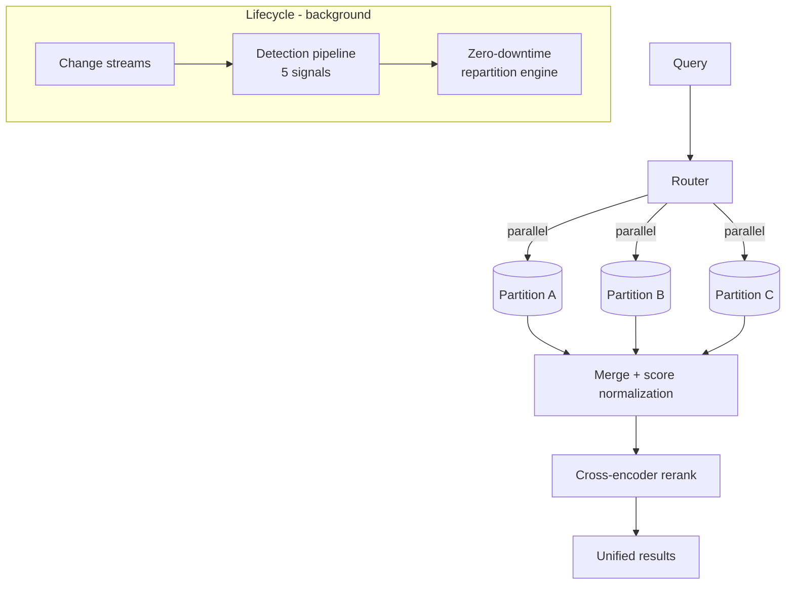

# Semantic Vector Router (SVR) — Experimental

> **A Python SDK that keeps vector search accurate at scale by automatically partitioning, routing, merging, and reranking across MongoDB Atlas Vector Search.**
> **Status: Experimental research prototype** — APIs and design may change; not a supported product release.
> Sanitized public version of a real-world prototype — client names, credentials, and internal endpoints removed; all configuration is environment-driven (`.env.example`). Authored by [Paul Cleenewerck](https://github.com/pcleene).

## The problem

Vector search quality degrades under two conditions that often co-occur:

1. **Scale** — past tens of millions of vectors, ANN approximation error and quantization noise compound, so recall drops and p95 latency climbs.
2. **Heterogeneity** — mixing unrelated content (products + tickets + contracts) pollutes the embedding space, so irrelevant neighbors surface with deceptively high scores.

Naïve fixes don't hold up: **pre-filtering** traverses a broken ANN graph (missing edges), and **post-filtering** can return mostly-empty result sets when the filter is selective.

## The approach

SVR partitions a large/heterogeneous vector space into coherent sub-indexes, then makes that transparent to application code: you say *what* to search, SVR handles parallel execution, score-normalized merging, and optional cross-encoder reranking.



## What it does

| Area | Capability |
|------|-----------|
| **Index modes** | `VIEWS` (index per partition), `SOURCE` (single index + pre-filter), `FIELDS` (per-partition embedding fields) |
| **Embedders** | OpenAI, Voyage AI, Cohere, HuggingFace (local) — shared/asymmetric embedding spaces |
| **Reranking** | Cross-encoder rerankers (Voyage AI, Cohere) for unified relevance |
| **Lifecycle** | Auto-provisioning, change streams, health monitoring, auto-split |
| **Detection pipeline** | 5 signal types (threshold breach, approaching, skew, underpopulated, stale) in a COLLECT → STORE → ANALYZE → DECIDE loop |
| **Repartition engine** | 5-step, zero-downtime repartitioning with resume + rollback |
| **CLI** | 11 command groups (init, partitions, search, analyze, watch, split, config, index, monitor, repartition, cache) |
| **State** | `svr_metadata` collection for partition state, operations, and distributed locks |
| **Resilience** | `@with_retry` exponential backoff, configurable timeouts/pools, connection health checks |
| **Observability** | JSON structured logging, correlation IDs, pluggable metrics handlers |
| **Performance** | Thread-safe LRU + TTL embedding cache; tunable connection pools |

## What this demonstrates

- SDK/library design (not just an app): clean public surface, configuration system, pluggable backends and embedders.
- Distributed-systems concerns done deliberately: distributed locks, resumable/rollback-able migrations, retry and health checks.
- A real test pyramid — `unit`, `integration`, `functional`, and `performance` suites.

## Tech stack

Python · MongoDB Atlas Vector Search · OpenAI / Voyage AI / Cohere / HuggingFace embedders · cross-encoder rerankers

## Quick start

```bash
cp .env.example .env            # add your Atlas URI + embedding-provider keys
pip install -e .
svr --help                      # explore the CLI command groups
```

See `docs/architecture/ARCHITECTURE.md` for the full design and `docs/roadmap/` for direction. This is a research prototype — expect rough edges and changing APIs.

## Author

[Paul Cleenewerck](https://github.com/pcleene) — MongoDB-focused solution architecture and hands-on prototyping.

## License

See `LICENSE`. If no license file is present, contact the author before reuse.
